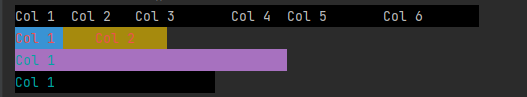

# Java Console Printer

Java console application to format the Console Output.



For many of my console applications for Java I have had a need to format the `Console Output` in a specific manner to organize the text. 

I have never found anything to matches my exact need, and therefore I have created my own that I use in my java projects, where I need formatting of console output.

The Console printer is based on `Cascading Commands` which are `flushed and cleard` when printing to the `Console`. Sample usage:
```
Printer printer = new ConsolePrinter();

printer.addCommand(new BackgroundColorCommand(Color.BLACK));
printer.addCommand(new TextColorCommand(Color.DEFAULT));
printer.addCommand(new TextCommand("Some text"));
printer.addCommand(new ColumnCommand(6));
printer.addCommand(new AlignmentCommand(Alignment.LEFT));
printer.print();
```


